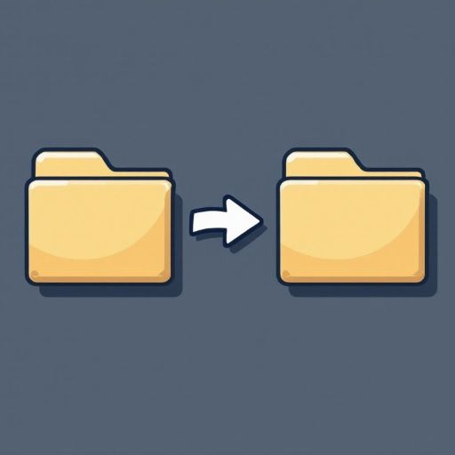

## DirSync  
  
  
A super simple directory mirroring tool.  
Can also be used to mirror entire drives.  
Written in pure Python.  
Open-source under MIT License.  
Free for personal and commercial use.  
Utilizes Windows robocopy under the hood for maximum efficiency.  
Make and maintain backups easily.
  
## How to use DirSync  
1. Download DirSync.exe from the releases page.  
2. Open DirSync.exe.  
3. Select a source directory and destination directory.  
4. Click the Start Sync button.

You can add or remove directory pairs as needed. You can also save and load pair configurations as JSON from the File menu.  
Thread Count will improve speed at the cost of CPU usage. I suggest looking up how many threads your CPU has before changing this number.  
You can set an Interval and then Start Scheduled Sync to repeat the operation every X hours.
  
WARNING: The sync operation is a mirror, not a copy. This means any files or folders in the destination that are not in the source will be removed.
